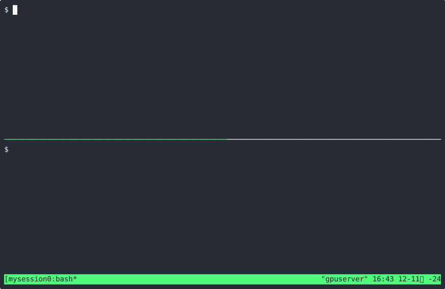
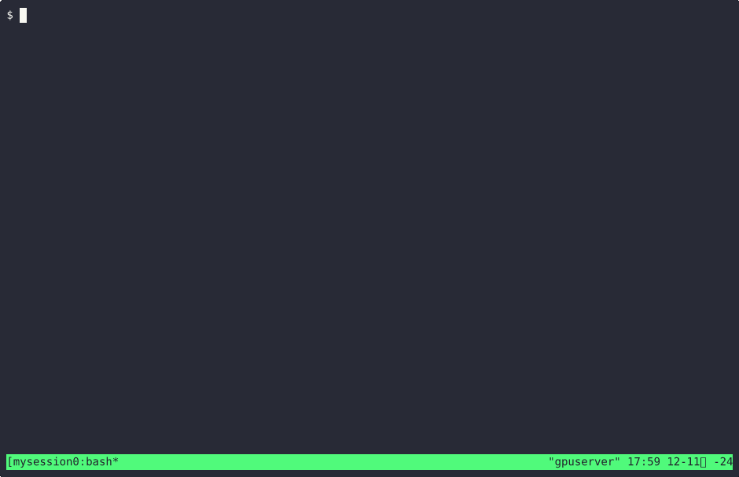

# pyftrace

## Introduction

**pyftrace**는 Python 스크립트 내에서 함수 호출을 모니터링할 수 있는 경량 Python 함수 추적 도구입니다. Python 3.8 ~3.11 버전에서는 `sys.setprofile`을,  Python 3.12 이상 버전에서는 `sys.monitoring`을 활용하여 Python 이벤트를 모니터링하고, 모니터링 결과를 기반으로 함수 호출/리턴을 추적합니다. pyftrace를 사용하면 여러 모듈에 걸친 함수 호출을 추적할 수 있고, 호출 계층 구조를 시각적으로 나타낼 수 있으며, 추적 결과 보고서를 생성할 수 있습니다.



pyftrace의 주요 기능:

- **함수 호출/반환 추적**: Python 스크립트 및 임포트된 모듈 내의 함수 호출/반환을 모니터링합니다.
- **내장 함수 추적**: `--verbose` 옵션을 사용하여 `print`와 같은 내장 함수를 선택적으로 추적할 수 있습니다.
- **다중 모듈 추적**: 여러 파일에 걸친 함수 추적을 지원합니다.
- **실행 보고서**: `--report` 옵션을 사용하여 함수 실행 시간 및 호출 횟수를 상세히 기록한 보고서를 생성합니다.
- **경로 추적**: `--path` 옵션을 사용하여 추적된 Python 파일의 경로를 추적합니다.
- **TUI 모드**: `tui` 명령을 사용하여 텍스트 사용자 인터페이스(TUI) 모드에서 pyftrace를 실행할 수 있습니다.
- **함수 필터링**: `--function` 옵션을 사용하여 특정 함수와 해당 하위 호출을 추적할 수 있습니다.

```
$ pyftrace --help
usage: pyftrace [options] [tui] script [script_args ...]

pyftrace: Python function tracing tool.

positional arguments:
  script         Path to the script to run and trace. Specify 'tui' before the script path to run in TUI mode.

options:
  -h, --help     show this help message and exit
  -V, --version  Show the version of pyftrace and exit
  -v, --verbose  Enable built-in and third-party function tracing
  -p, --path     Show file paths in tracing output
  -r, --report   Generate a report of function execution times
  -d DEPTH, --depth DEPTH
                        Limit the tracing output to DEPTH
  -f FUNCTION, --function FUNCTION
                        Trace only calls of <function> and its subcalls
```

## 사용법

### 요구 사항

- **Python 버전**: pyftrace는 Python 3.8 이상이 필요합니다.

```bash
$ pyftrace [options] /path/to/python/script.py
```

### 설치

```
$ git clone https://github.com/kangtegong/pyftrace.git
$ cd pyftrace
$ pip install -e .
```

또는

```
$ pip install pyftrace
```

> note: 윈도우에서는 windows-curses 설치 필요


### 기본 옵션

- `--report` 또는 `-r`: 스크립트 실행이 끝난 후 함수 실행 시간 및 호출 횟수 보고서를 생성합니다.
- `--verbose` 또는 `-v`: 내장 함수(print, len 등)의 추적을 활성화합니다. 이 옵션 없이 사용될 경우 pyftrace는 사용자 정의 함수만 추적합니다.
- `--path` 또는 `-p`: 추적 출력에 파일 경로를 포함합니다.
- `--help` 또는 `-h`: pyftrace 및 해당 옵션에 대한 도움말 정보를 표시합니다.
- `--version` 또는 `-V`: pyftrace 버전을 출력합니다.
- `--depth` 또는 `-d`: 함수 호출 추적 깊이를 제한합니다.
- `--function` 또는 `-f`: 특정 함수만 추적하고 해당 하위 호출을 모니터링합니다.

## TUI

pyftrace를 TUI(텍스트 사용자 인터페이스) 모드에서 실행하려면 스크립트 경로 앞에 tui 명령을 사용하세요.

```bash
pyftrace [options] tui path/to/your_script.py
```

### 주요 키

- `↑` 또는 `↓`: 한 줄씩 위아래로 스크롤합니다.
- `PgUp` 또는 `PgDn`: 한 페이지씩 위아래로 스크롤합니다.
- `Home` 또는 `End`: 추적의 시작 또는 끝으로 이동합니다.
- `←` 또는 `→`: 좌우로 수평 스크롤합니다.
- `q`: TUI 모드를 종료합니다.



## 예제

examples/ 디렉토리에는 pyftrace를 사용하여 추적할 수 있는 다양한 Python 파일이 포함되어 있습니다.

아래 예제에서는 여러 파일에 걸친 `main_script.py`는 `module_a.py`와 `module_b.py`의 함수를 추적하는 모습이 담겨 있습니다.

```python
# module_a.py
  1 def function_a():
  2     print("Function A is called.")
  3     return "ret_a"
```

```python
# module_b.py
  1 def function_b():
  2     print("Function B is called.")
  3     return "ret_b"
```

```python
# main_script.py
  1 from module_a import function_a
  2 from module_b import function_b
  3
  4 def main():
  5     result_a = function_a()
  6     result_b = function_b()
  7     print(f"Results: {result_a}, {result_b}")
  8
  9 if __name__ == "__main__":
 10     main()
```

### 기본 추적

내장 함수나 파일 경로를 포함하지 않고 main_script.py의 함수 호출을 추적하려면:

```
$ pyftrace examples/module_trace/main_script.py
```

출력 결과:
```
Running script: examples/module_trace/main_script.py
Called main from line 10
    Called function_a from line 5
Function A is called.
    Returning function_a-> ret_a
    Called function_b from line 6
Function B is called.
    Returning function_b-> ret_b
Results: ret_a, ret_b
Returning main-> None
Returning <module>-> None
```

### `--verbose`로 내장 함수 추적

```
$ pyftrace --verbose examples/module_trace/main_script.py
```

출력 결과:
```
Running script: examples/module_trace/main_script.py
Called main from line 10
    Called function_a from line 5
        Called print from line 2
Function A is called.
        Returning print
    Returning function_a-> ret_a
    Called function_b from line 6
        Called print from line 2
Function B is called.
        Returning print
    Returning function_b-> ret_b
    Called print from line 7
Results: ret_a, ret_b
    Returning print
Returning main-> None
Returning <module>-> None
```

### `--path`로 파일 경로 추적

```
$ pyftrace --path examples/module_trace/main_script.py
```

이 경우, 함수가 호출될 때 pyftrace는 함수 추적 결과를 다음 형식으로 출력됩니다:

```
Called {function} @ {defined file path}:{defined line} from {called file path}:{called line}
```

- `{function}`: name of the function being called 
- `{defined file path}`: file path where the function is defined (enabled with `--path` option)
- `{defined line}`" line number in the defined file
- `{called line}` line number in the calling file
- `{called file path}` path to the file that contains the calling function (enabled with `--path` option)


출력 결과:
```
Running script: examples/module_trace/main_script.py
Called main@examples/module_trace/main_script.py:4 from examples/module_trace/main_script.py:10
    Called function_a@examples/module_trace/module_a.py:1 from examples/module_trace/main_script.py:5
Function A is called.
    Returning function_a-> ret_a @ examples/module_trace/module_a.py
    Called function_b@examples/module_trace/module_b.py:1 from examples/module_trace/main_script.py:6
Function B is called.
    Returning function_b-> ret_b @ examples/module_trace/module_b.py
Results: ret_a, ret_b
Returning main-> None @ examples/module_trace/main_script.py
Returning <module>-> None @ examples/module_trace/main_script.py
```

### 실행 보고서 생성

함수 실행 시간 및 호출 횟수의 요약 보고서를 생성하려면:

```
$ pyftrace --report examples/module_trace/main_script.py
```

출력 결과:
```
Running script: examples/module_trace/main_script.py
Function A is called.
Function B is called.
Results: ret_a, ret_b

Function Name	| Total Execution Time	| Call Count
---------------------------------------------------------
main           	| 0.000082 seconds	| 1
function_a     	| 0.000022 seconds	| 1
function_b     	| 0.000008 seconds	| 1
```

### `--verbose`와 `--path` 결합

내장 함수를 추적하고 파일 경로를 포함하려면:

```
$ pyftrace --verbose --path examples/module_trace/main_script.py
$ pyftrace -vp examples/module_trace/main_script.py
```

출력 결과:
```
Running script: examples/module_trace/main_script.py
Called main@examples/module_trace/main_script.py:4 from examples/module_trace/main_script.py:10
    Called function_a@examples/module_trace/module_a.py:1 from examples/module_trace/main_script.py:5
        Called print@builtins from examples/module_trace/module_a.py:2
Function A is called.
        Returning print @ examples/module_trace/module_a.py
    Returning function_a-> ret_a @ examples/module_trace/module_a.py
    Called function_b@examples/module_trace/module_b.py:1 from examples/module_trace/main_script.py:6
        Called print@builtins from examples/module_trace/module_b.py:2
Function B is called.
        Returning print @ examples/module_trace/module_b.py
    Returning function_b-> ret_b @ examples/module_trace/module_b.py
    Called print@builtins from examples/module_trace/main_script.py:7
Results: ret_a, ret_b
    Returning print @ examples/module_trace/main_script.py
Returning main-> None @ examples/module_trace/main_script.py
Returning <module>-> None @ examples/module_trace/main_script.py
```

### `--verbose`와 `--report` 결합

```
$ pyftrace --verbose --report examples/module_trace/main_script.py
$ pyftrace -vr examples/module_trace/main_script.py
```

출력 결과:
```
Running script: examples/module_trace/main_script.py
Function A is called.
Function B is called.
Results: ret_a, ret_b

Function Name	| Total Execution Time	| Call Count
---------------------------------------------------------
main           	| 0.000127 seconds	| 1
print          	| 0.000041 seconds	| 3
function_a     	| 0.000021 seconds	| 1
function_b     	| 0.000016 seconds	| 1
```


### 참고
simple-pyftrace.py는 Pycon Korea 2024 발표를 위한 간소화된 pyftrace 스크립트입니다. 약 100줄의 코드로 구성되어 있지만 기능이 제한적입니다.

## LICENESE

MIT 

자세한 정보는 [LICENSE](./LICENSE)를 참조하세요.

## See Also

pyftrace에 영감을 준 프로젝트:

- [ftrace](https://www.kernel.org/doc/Documentation/trace/ftrace.txt): 리눅스 커널을 위한 내부 함수 추적 도구.
- [uftrace](https://github.com/namhyung/uftrace): C, C++, Rust 및 Python 프로그램용 함수 호출 추적 도구.
