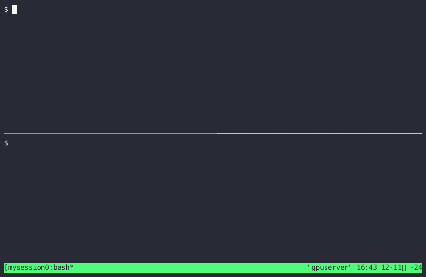
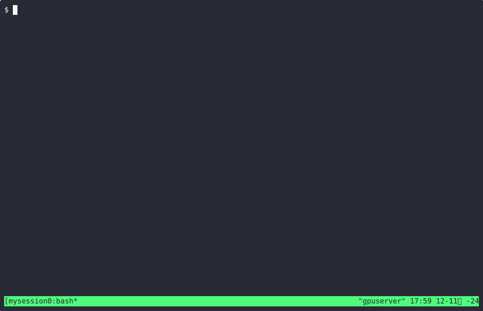

[한국어](https://github.com/kangtegong/pyftrace/blob/main/README-ko.md)

> [!NOTE]
> **I hope to get a lot of use and feedback on this project.**
>
> **If you have any feedback, feel free to leave a comment.**
>
> **I hope you enjoy using this :)**

# pyftrace

## Introduction

**pyftrace** is a lightweight Python function tracing tool designed to monitor and report on function calls within Python scripts. It leverages sys.setprofile(Python 3.8 ~ 3.11), sys.monitoring(Python 3.12 ~) to monitor Python events and trace functions based on the results. With pyftrace, you can trace function calls across multiple modules, visualize call hierarchies, and generate execution time reports.



Key features of pyftrace include:

- **Function Call/Return Tracing**: Monitor calls/returns to functions in Python script and imported modules.
- **Built-in, Library Function Tracing**: Pyftrace can not only trace user-defined functions, but also trace functions in external libraries or built-in functions (e.g. `print`, `len`) with `--verbose`/`-v` option.
- **Multiple Module Tracing Support**: Trace functions across multiple files.
- **Execution Reports**: Generate reports detailing function execution times and call counts with the `--report`/`-r` option.
- **File Path Tracing**: Trace the file path of traced Python file with `--path`/`-p` option.
- **Limit Tracing Depth**: Control the depth of function call tracing with the `--depth`/`-d` option.
- **TUI Mode**: Run pyftrace in a Text User Interface (TUI) mode using the `tui` command.

```
$ pyftrace --help
usage: pyftrace [options] [tui] script [script_args ...]

pyftrace: Python function tracing tool.

positional arguments:
  script                Path to the script to run and trace. Specify 'tui' before the script path to run in TUI mode.

options:
  -h, --help            show this help message and exit
  -V, --version         Show the version of pyftrace and exit
  -v, --verbose         Enable built-in and third-party function tracing
  -p, --path            Show file paths in tracing output
  -r, --report          Generate a report of function execution times
  -d DEPTH, --depth DEPTH
                        Limit the tracing output to DEPTH
```

## Usage

### Requirements

- **Python Version**: pyftrace requires **Python 3.8+**.

```bash
$ pyftrace [options] /path/to/python/script.py
```

### Installation

```
$ git clone https://github.com/kangtegong/pyftrace.git
$ cd pyftrace
$ pip install -e .
```

or

```
$ pip install pyftrace
```

> note: on Windows, `windows-curses` is required.


### Command-Line Options

- `--report` or `-r`: Generate a report of function execution times and call counts at the end of the script's execution.
- `--verbose` or `-v`: Enable tracing of built-in functions (e.g., print, len). Without this flag, pyftrace only traces user-defined functions.
- `--path` or `-p`: Include file paths in the tracing output. 
- `--help` or `-h`: Display help information about pyftrace and its options.
- `--version` or `-V`: Display help information about pyftrace and its options.
- `--depth` or `-d`: Limit the depth of the trace.

## TUI

To run pyftrace in TUI(Text User Interface) mode, use the `tui` command before the script path.

```bash
pyftrace [options] tui path/to/your_script.py
```

### Key Bindings

- `↑` or `↓`: Scroll up or down one line at a time.
- `PgUp` or `PgDn`: Scroll up or down one page at a time.
- `Home` or `End`: Jump to the beginning or end of the trace.
- `←` or `→`: Scroll left or right horizontally.
- `q`: Quit the TUI mode.



## Examples

The `examples/` directory contains a variety of Python files that can be traced using pyftrace. 

In this example, `main_script.py` imports and calls functions from `module_a.py` and `module_b.py`. We'll use pyftrace to trace these function calls and understand the flow of execution.

```python
# module_a.py
  1 def function_a():
  2     print("Function A is called.")
  3     return "ret_a"
```

```python
# module_b.py
  1 def function_b():
  2     print("Function B is called.")
  3     return "ret_b"
```

```python
# main_script.py
  1 from module_a import function_a
  2 from module_b import function_b
  3
  4 def main():
  5     result_a = function_a()
  6     result_b = function_b()
  7     print(f"Results: {result_a}, {result_b}")
  8
  9 if __name__ == "__main__":
 10     main()
```

### Basic Tracing

To trace function calls in main_script.py without including built-in functions or file paths:

```
$ pyftrace examples/module_trace/main_script.py
```

output:
```
Running script: examples/module_trace/main_script.py
    Called main from line 10
        Called function_a from line 5
Function A is called.
        Returning function_a-> ret_a
        Called function_b from line 6
Function B is called.
        Returning function_b-> ret_b
Results: ret_a, ret_b
    Returning main-> None
```

### Trace Built-in Functions with `--verbose`

```
$ pyftrace --verbose examples/module_trace/main_script.py
```

output:
```
Running script: examples/module_trace/main_script.py
    Called main from line 10
        Called function_a from line 5
            Called print from line 2
Function A is called.
            Returning print
        Returning function_a-> ret_a
        Called function_b from line 6
            Called print from line 2
Function B is called.
            Returning print
        Returning function_b-> ret_b
        Called print from line 7
Results: ret_a, ret_b
        Returning print
    Returning main-> None
```

### Showing File Paths with `--path`

```
$ pyftrace --path examples/module_trace/main_script.py
```

In this case, When a function is called, pyftrace displays it in the following format:

```
Called {function} [@ {defined file path}:{defined line}] from {called file path}:{called line}
```

- `{function}`: name of the function being called 
- `{defined file path}`: file path where the function is defined (enabled with `--path` option)
- `{defined line}`" line number in the defined file
- `{called line}` line number in the calling file
- `{called file path}` path to the file that contains the calling function (enabled with `--path` option)

output:
```
Running script: examples/module_trace/main_script.py
    Called main@examples/module_trace/main_script.py:4 from examples/module_trace/main_script.py:10
        Called function_a@examples/module_trace/module_a.py:1 from examples/module_trace/main_script.py:5
Function A is called.
        Returning function_a-> ret_a @ examples/module_trace/module_a.py
        Called function_b@examples/module_trace/module_b.py:1 from examples/module_trace/main_script.py:6
Function B is called.
        Returning function_b-> ret_b @ examples/module_trace/module_b.py
Results: ret_a, ret_b
    Returning main-> None @ examples/module_trace/main_script.py
```

### Generating an Execution Report

To generate a summary report of function execution times and call counts:

```
$ pyftrace --report examples/module_trace/main_script.py
```

output:
```
Running script: examples/module_trace/main_script.py
Function A is called.
Function B is called.
Results: ret_a, ret_b

Function Name	| Total Execution Time	| Call Count
---------------------------------------------------------
main           	| 0.000082 seconds	| 1
function_a     	| 0.000022 seconds	| 1
function_b     	| 0.000008 seconds	| 1
```

### Combining `--verbose` and `--path`

To trace built-in functions and include file paths:

```
$ pyftrace --verbose --path examples/module_trace/main_script.py
$ pyftrace -vp examples/module_trace/main_script.py
```

output:
```
Running script: examples/module_trace/main_script.py
    Called main@examples/module_trace/main_script.py:4 from examples/module_trace/main_script.py:10
        Called function_a@examples/module_trace/module_a.py:1 from examples/module_trace/main_script.py:5
            Called print from examples/module_trace/module_a.py:2
Function A is called.
            Returning print
        Returning function_a-> ret_a @ examples/module_trace/module_a.py
        Called function_b@examples/module_trace/module_b.py:1 from examples/module_trace/main_script.py:6
            Called print from examples/module_trace/module_b.py:2
Function B is called.
            Returning print
        Returning function_b-> ret_b @ examples/module_trace/module_b.py
        Called print from examples/module_trace/main_script.py:7
Results: ret_a, ret_b
        Returning print
    Returning main-> None @ examples/module_trace/main_script.py
```

### Combining `--verbose` and `--report`

```
$ pyftrace --verbose --report examples/module_trace/main_script.py
$ pyftrace -vr examples/module_trace/main_script.py
```

output:
```
Running script: examples/module_trace/main_script.py
Function A is called.
Function B is called.
Results: ret_a, ret_b

Function Name	| Total Execution Time	| Call Count
---------------------------------------------------------
main           	| 0.000127 seconds	| 1
print          	| 0.000041 seconds	| 3
function_a     	| 0.000021 seconds	| 1
function_b     	| 0.000016 seconds	| 1
```

### Limiting the trace depth

```
$ pyftrace examples/module_trace/main_script.py --depth 1
$ pyftrace examples/module_trace/main_script.py -d 2
```

output:

```
$ pyftrace examples/module_trace/main_script.py --depth 1
Running script: examples/module_trace/main_script.py
    Called main from line 10
Function A is called.
Function B is called.
Results: ret_a, ret_b
    Returning main-> None

$ pyftrace examples/module_trace/main_script.py -d 2
Running script: examples/module_trace/main_script.py
    Called main from line 10
        Called function_a from line 5
Function A is called.
        Returning function_a-> ret_a
        Called function_b from line 6
Function B is called.
        Returning function_b-> ret_b
Results: ret_a, ret_b
    Returning main-> None
```


### Notes
- simple-pyftrace.py is a simplified pyftrace script for the [Pycon Korea 2024](https://2024.pycon.kr/) presentation. It is about 100 lines of code, but has limited functionality. 

## LICENESE

MIT 

See [LICENSE](./LICENSE) for more infomation

## See Also

pyftrace is heavily inspired by:

- [ftrace](https://www.kernel.org/doc/Documentation/trace/ftrace.txt): Ftrace is an internal tracer for linux kernel.
- [uftrace](https://github.com/namhyung/uftrace): uftrace is a function call graph tracer for C, C++, Rust and Python programs.
