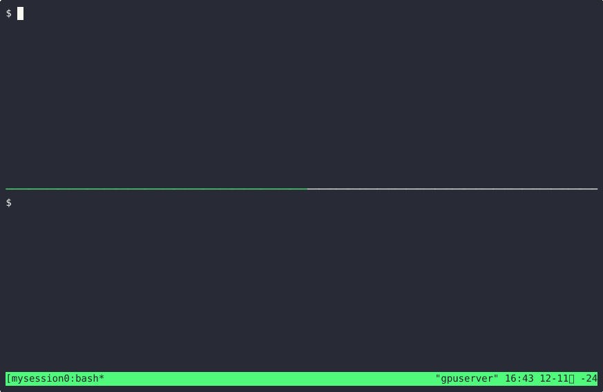

# pyftrace

## Introduction

**pyftrace** is a lightweight Python function tracing tool designed to monitor and report on function calls within Python scripts. It leverages Python 3.12's built-in monitoring capabilities to provide insights into the execution flow of your programs. With pyftrace, you can trace function calls across multiple modules, visualize call hierarchies, and generate execution time reports.



Key features of pyftrace include:

- **Function Call Tracing**: Monitor calls to functions in your script and imported modules.
- **Built-in Function Tracing**: Optionally trace built-in functions like `print` using the `--verbose` flag.
- **Multiple Module Support**: Trace functions across multiple files within your project.
- **Execution Reports**: Generate reports detailing function execution times and call counts with the `--report` flag.
- **Path Tracing**: Use the `--path` flag to include file paths in tracing output.

## Usage

### Requirements

- **Python Version**: pyftrace requires **Python 3.12** or higher due to its use of the new `sys.monitoring` module introduced in Python 3.12.

```bash
$ pyftrace [options] /path/to/python/script
```


### Installation

```
$ https://github.com/kangtegong/pyftrace.git
$ pip install -e .
```

```
$ pip install pyftrace
```


### Command-Line Options

- `--report`: Generate a report of function execution times and call counts at the end of the script's execution.
- `--verbose`: Enable tracing of built-in functions (e.g., print, len). Without this flag, pyftrace only traces user-defined functions.
- `--path`: Include file paths in the tracing output. 
- `-h` or `--help`: Display help information about pyftrace and its options.

## Examples

The `examples/` directory contains a variety of Python files that can be traced using pyftrace. 

When a function is called, pyftrace displays it in the following format:

```
Called {function} @ {defined file path}:{defined line} from {called file path}:{called line}
```

- `{function}`: name of the function being called 
- `{defined file path}`: file path where the function is defined (enabled with `--path` option)
- `{defined line}`" line number in the defined file
- `{called line}` line number in the calling file
- `{called file path}` path to the file that contains the calling function (enabled with `--path` option)

In this example, `main.py` imports and calls functions from `module_a.py` and `module_b.py`. We'll use pyftrace to trace these function calls and understand the flow of execution.

```python
# module_a.py
def function_a():
    print("Function A is called.")
    return "Result from function A"
```

```python
# module_b.py
def function_b():
    print("Function B is called.")
    return "Result from function B"
```

```python
# main.py
from module_a import function_a
from module_b import function_b

def main():
    result_a = function_a()
    result_b = function_b()
    print(f"Results: {result_a}, {result_b}")

if __name__ == "__main__":
    main()
```

### Basic Tracing

To trace function calls in main.py without including built-in functions or file paths:


```
$ pyftrace examples/module_trace/main.py
```

output:
```
Running script: examples/module_trace/main.py
Called main:4 from line 10
    Called function_a:1 from line 5
Function A is called.
        Returning function_a-> Result from function A
    Called function_b:1 from line 6
Function B is called.
        Returning function_b-> Result from function B
Results: Result from function A, Result from function B
    Returning main-> None
Returning <module>-> None
```

### Including Built-in Functions with `--verbose`

```
$ pyftrace --verbose examples/module_trace/main.py
```

output:
```
Running script: examples/module_trace/main.py
Called main:4 from line 10
    Called function_a:1 from line 5
        Called print from line 2
Function A is called.
            Returning print
        Returning function_a-> Result from function A
    Called function_b:1 from line 6
        Called print from line 2
Function B is called.
            Returning print
        Returning function_b-> Result from function B
    Called print from line 7
Results: Result from function A, Result from function B
        Returning print
    Returning main-> None
Returning <module>-> None
```

### Showing File Paths with `--path`

```
$ pyftrace --path examples/module_trace/main.py
```

output:
```
Running script: examples/module_trace/main.py
Called main@/path/to/examples/module_trace/main.py:4 from line 10 @ examples/module_trace/main.py
    Called function_a@/path/to/examples/module_trace/module_a.py:1 from line 5 @ examples/module_trace/main.py
Function A is called.
        Returning function_a-> Result from function A @ /path/to/examples/module_trace/module_a.py
    Called function_b@/path/to/examples/module_trace/module_b.py:1 from line 6 @ examples/module_trace/main.py
Function B is called.
        Returning function_b-> Result from function B @ /path/to/examples/module_trace/module_b.py
Results: Result from function A, Result from function B
    Returning main-> None @ /path/to/examples/module_trace/main.py
Returning <module>-> None @ /path/to/examples/module_trace/main.py
```

### Generating an Execution Report

To generate a summary report of function execution times and call counts:

```
$ pyftrace --report examples/module_trace/main.py
```

output:
```
Running script: examples/module_trace/main.py
Returning <module>-> None

Function Name     | Total Execution Time  | Call Count
---------------------------------------------------------
main              | 0.000123 seconds      | 1
function_a        | 0.000456 seconds      | 1
function_b        | 0.000789 seconds      | 1
```

### Combining `--verbose` and `--path`

To trace built-in functions and include file paths:

```
$ pyftrace --verbose --path examples/module_trace/main.py
```

output:
```
Running script: examples/module_trace/main.py
Called main@/path/to/examples/module_trace/main.py:4 from line 10 @ examples/module_trace/main.py
    Called function_a@/path/to/examples/module_trace/module_a.py:1 from line 5 @ examples/module_trace/main.py
        Called print@<builtin> from line 2 @ /path/to/examples/module_trace/module_a.py
Function A is called.
            Returning print @ /path/to/examples/module_trace/module_a.py
        Returning function_a-> Result from function A @ /path/to/examples/module_trace/module_a.py
    Called function_b@/path/to/examples/module_trace/module_b.py:1 from line 6 @ examples/module_trace/main.py
        Called print@<builtin> from line 2 @ /path/to/examples/module_trace/module_b.py
Function B is called.
            Returning print @ /path/to/examples/module_trace/module_b.py
        Returning function_b-> Result from function B @ /path/to/examples/module_trace/module_b.py
    Called print@<builtin> from line 7 @ examples/module_trace/main.py
Results: Result from function A, Result from function B
        Returning print @ examples/module_trace/main.py
    Returning main-> None @ /path/to/examples/module_trace/main.py
Returning <module>-> None @ /path/to/examples/module_trace/main.py
```

### Notes
- simple-pyftrace.py is a simplified pyftrace script for the [Pycon Korea 2024](https://2024.pycon.kr/) presentation. It is about 100 lines of code, but has limited functionality. 

## LICENESE

MIT 

See [LICENSE](./LICENSE) for more infomation

## See Also

pyftrace is heavily inspired by:

- [ftrace](https://www.kernel.org/doc/Documentation/trace/ftrace.txt): Ftrace is an internal tracer for linux kernel.
- [uftrace](https://github.com/namhyung/uftrace): uftrace is a function call graph tracer for C, C++, Rust and Python programs. 
